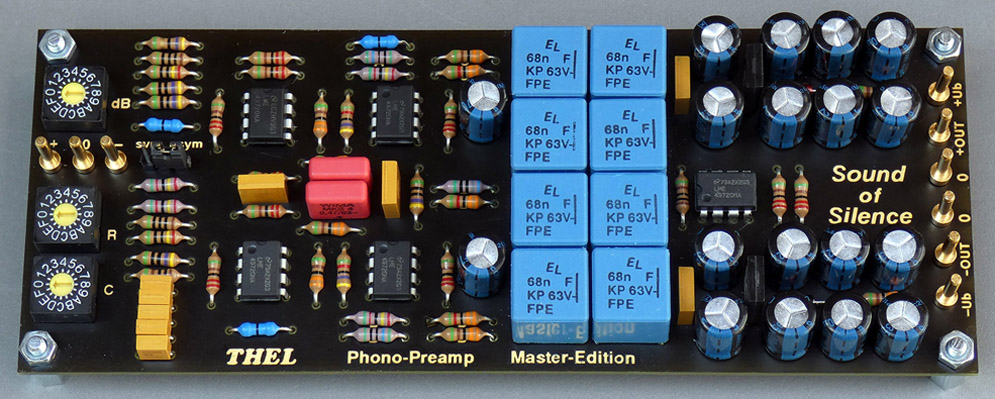

### High-End:  
* "VX-5021P" 1996 https://web.archive.org/web/20160323223326/http://thel-audioworld.de/test/test.htm#VX5021
* "Phono-M" 2006 https://web.archive.org/web/20070626215210/http://www.thel-audioworld.de/module/phono/phono-M.htm
* "Phono-HQ" 12/2017 https://web.archive.org/web/20180203013342/http://www.thel-audioworld.de/module/phono/phono-hq.htm
* <b>\"<a href="/hardware/beautiful%20noise">Beautiful-Noise</a>\" 09/2018</b>  
Stereo module / 2 channels galvanically isolated / single ended inputs, single ended outputs  
two-stage passive RIAA-filter  
adjustable gain (6-step) / input resistance changeable (by soldering) / input capacity changeable (by soldering)  
https://web.archive.org/web/20190110103246/http://www.thel-audioworld.de/module/phono/Phonovorstufe-B.htm

### Ultra-High-End:  
* "Majestic" 1998 https://web.archive.org/web/20160323223326/http://thel-audioworld.de/test/test.htm#Majestic
* "VP2000" 2002 https://web.archive.org/web/20020410123225/http://thel-audioworld.de/module/phono/phono.htm
* "Phono-X" 2007-2017 https://web.archive.org/web/20070312044356/http://www.thel-audioworld.de/module/phono/phono.htm
* "Phono HQX" 12/2017  https://web.archive.org/web/20180203012402/http://www.thel-audioworld.de/module/phono/phono-hqx.htm
* <b>\"<a href="/hardware/sound%20of%20">Sound of Silence</a>\" 09/2018</b>  
Mono module / really\* fully symmetrical / balanced input -> balanced filter stages -> balanced output  
\*(no ground reference at any point in the audio signal chain)  
two-stage passive RIAA-filter  
adjustable input resistor (16-step) / adjustable input capacity (16-step) / adjustable gain (16-step)  
https://web.archive.org/web/20190109011016/http://www.thel-audioworld.de/module/phono/Phonovorstufe-S.htm  

----
#### "Beautiful-Noise":  
  

#### "Sound of Silence":  
  

