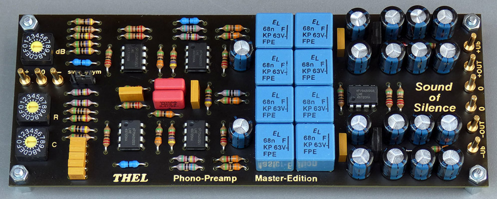

### RIAA Preamp "Sound of Silenc":  
Mono module / true\* fully symmetrical / balanced input -> balanced filter stages -> balanced output  
\*(no ground reference at any point in the audio signal chain)  
two-stage passive RIAA-filter  
adjustable input resistor (16-step) / adjustable input capacity (16-step) / adjustable gain (16-step)  
https://web.archive.org/web/20190109011016/http://www.thel-audioworld.de/module/phono/Phonovorstufe-S.htm  
  
  
  
calculation of the R C Values for the passive 2-step (inverse) RIAA filter:  
https://docs.google.com/spreadsheets/d/1qcIyMvDhxXAbTDFzf901tkU7BbxNvI2y0nLj_5HbEa4/edit?usp=sharing  

